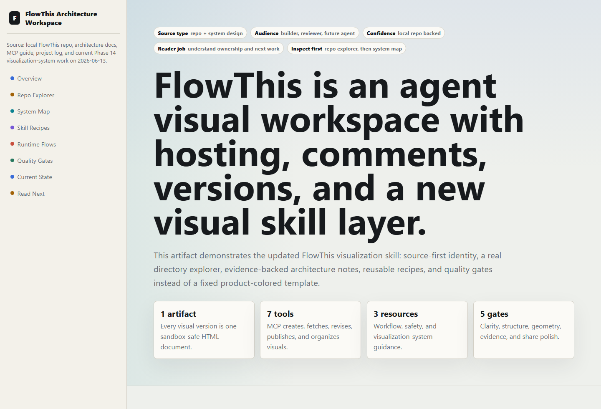
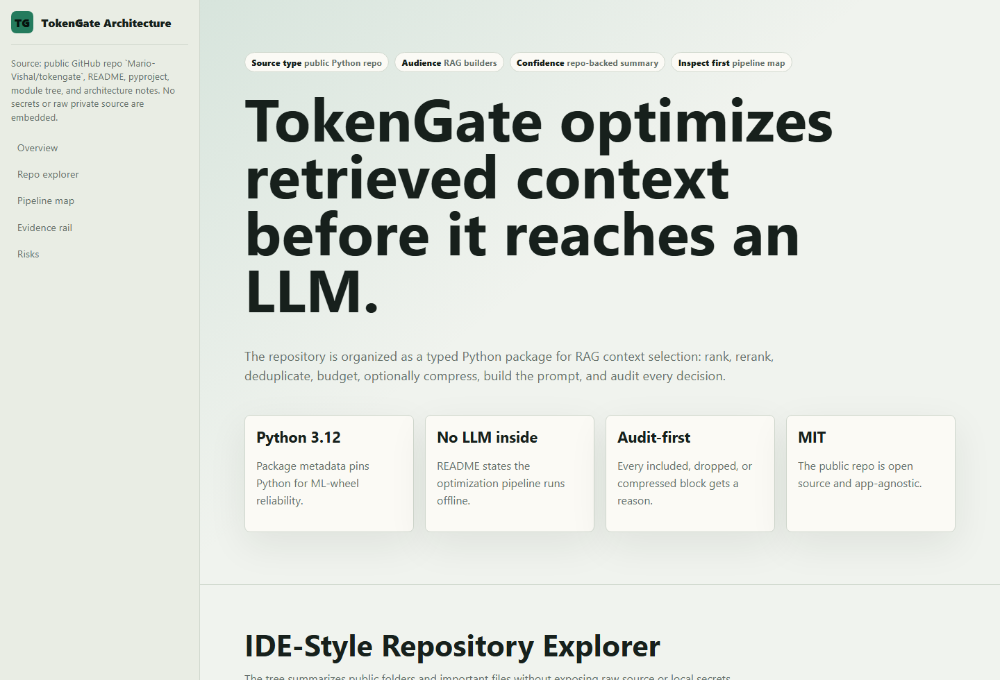
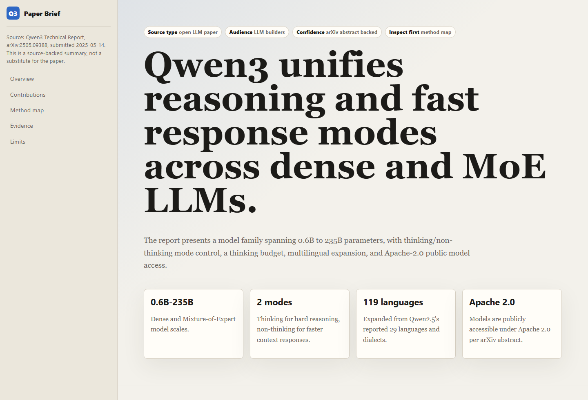
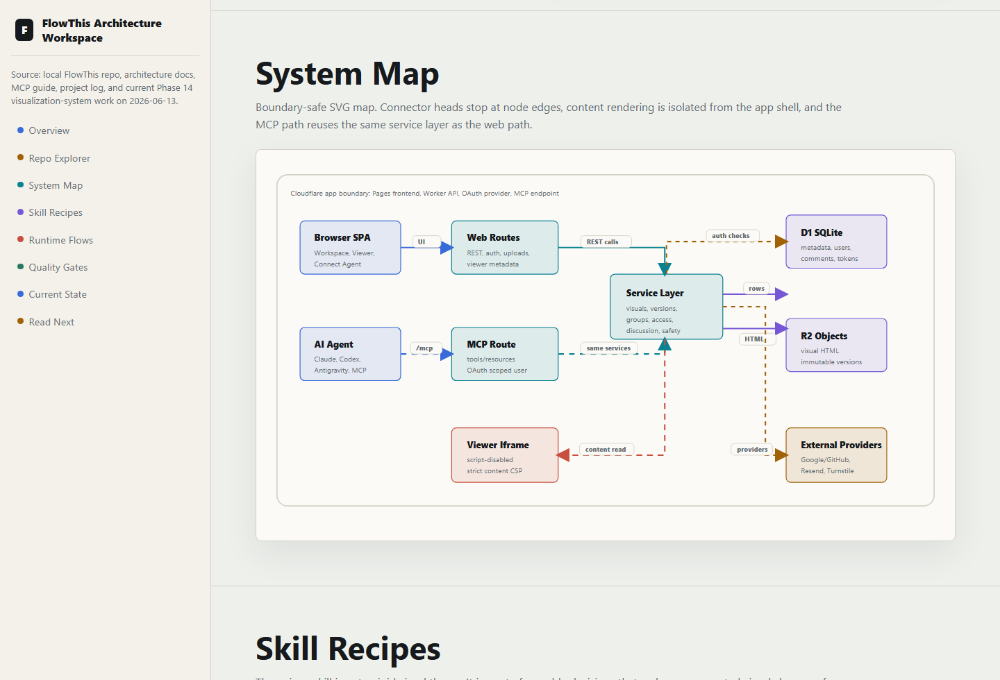

# FlowThis Visual Skill

**An open Agent Skill for turning papers, repositories, architecture notes,
conversations, workflows, and reports into polished, source-aware HTML visuals.**

FlowThis Visual Skill gives coding agents a visual operating system: classify
the source, choose the right structure, build a readable mini-site, keep
diagrams precise, label evidence, and ship one self-contained HTML file with no
JavaScript or external assets.

<p align="center">
  
</p>

## Why Use This

Most AI-generated visuals fail in the same ways: overloaded cards, generic
themes, vague structure, arrows crossing text, missing provenance, and no
reader path. This skill fixes that by making every visual follow five durable
rules:

- **Visual brief first:** source type, audience, confidence, reader job, and
  what to inspect first.
- **Source-first identity:** a repo can feel like an IDE, a paper can feel like
  an annotated brief, and a product page can feel editorial.
- **Reusable recipes:** explorer-detail panes, focus maps, evidence rails,
  decision ledgers, risk boards, figure digests, and read-next footers.
- **Boundary-safe diagrams:** arrows stop at node edges, avoid labels, and keep
  complex systems readable.
- **Share polish:** title, provenance, primary visual, details, caveats, and
  read-next sections are present even when the prompt is vague.

## Example Gallery

### Repository Architecture: TokenGate

Generated from the public
[`Mario-Vishal/tokengate`](https://github.com/Mario-Vishal/tokengate) repository
using only the FlowThis skill rules. It uses an IDE-style tree and a side detail
pane instead of dumping code. No secrets, env values, or raw private source are
embedded.

<p align="center">
  <a href="examples/tokengate-repo-architecture.html">
    
  </a>
</p>

Open: [`examples/tokengate-repo-architecture.html`](examples/tokengate-repo-architecture.html)

### Research Paper Brief: Qwen3 Technical Report

Generated from the open arXiv paper
[`Qwen3 Technical Report`](https://arxiv.org/abs/2505.09388). The visual follows
the paper route: identity, abstract rewrite, contribution cards, method map,
evidence matrix, limitations, and read-next notes.

<p align="center">
  <a href="examples/qwen3-paper-brief.html">
    
  </a>
</p>

Open: [`examples/qwen3-paper-brief.html`](examples/qwen3-paper-brief.html)

### FlowThis Architecture Workspace

The original repo/system example used to demonstrate the skill's architecture
workspace pattern.

<p align="center">
  <a href="examples/repo-architecture.html">
    
  </a>
</p>

Open: [`examples/repo-architecture.html`](examples/repo-architecture.html)

## Install In Claude Code

Copy the skill into your personal Claude Code skills directory:

```bash
mkdir -p ~/.claude/skills/flowthis
cp -R skills/flowthis/* ~/.claude/skills/flowthis/
```

Then ask:

```text
/flowthis visualize this repo
```

or:

```text
Turn this research paper into a FlowThis visual.
```

## Install In Codex

Codex can use the skill directly from an Agent Skills folder:

```bash
mkdir -p ~/.agents/skills/flowthis
cp -R skills/flowthis/* ~/.agents/skills/flowthis/
```

This repository also includes a Codex plugin manifest at
[`.codex-plugin/plugin.json`](.codex-plugin/plugin.json), so it can be packaged
as a Codex plugin when you want installable distribution.

## Use With FlowThis Cloud

This open repo is the visual-generation standard. FlowThis Cloud is the hosted
workspace for saving, sharing, discussing, and revising the generated visuals.

When FlowThis MCP tools are connected, the skill can save directly through
`create_visualization`. Without MCP, agents can still write a local
`flowthis-visual.html` file that can be uploaded manually.

## What The Skill Produces

Every output should be:

- one complete `<!doctype html>` document
- inline CSS and inline SVG only
- no JavaScript
- no remote fonts, styles, scripts, images, or iframes
- responsive at mobile and desktop widths
- source-specific in visual identity
- explicit about provenance and uncertainty
- structured with stable section ids where comments should attach

## Source Types

| Source | Default Visual Pattern |
| --- | --- |
| Research paper / PDF | Paper brief with contributions, method map, experiments, limits, read-next |
| Repository / codebase | IDE-style explorer, architecture map, flows, key contracts, risks |
| Software architecture | System boundaries, services, stores, request paths, failure points |
| Conversation / debug log | Timeline, decisions, blockers, current state, next actions |
| Product / advertisement | Offer page, audience, pain, benefits, proof, CTA |
| User stories / workflow | Actor map, journey lanes, handoffs, acceptance criteria |
| Data report | Headline insight, metric cards, charts, caveats, recommended action |

## Repository Layout

```text
.
  .codex-plugin/
    plugin.json
  skills/
    flowthis/
      SKILL.md
      agents/
        openai.yaml
      references/
        visualization-system.md
  examples/
    repo-architecture.html
    tokengate-repo-architecture.html
    qwen3-paper-brief.html
  assets/
    *.png
  docs/
    design-principles.md
    contributing.md
  CHANGELOG.md
  LICENSE
```

## Contributing

Contributions should improve the visual standard without turning it into a
rigid template system. Useful additions include new source-type recipes, better
diagram geometry rules, stronger examples, accessibility improvements, and safer
no-JS interaction patterns.

See [`docs/contributing.md`](docs/contributing.md).

## License

MIT. See [`LICENSE`](LICENSE).

